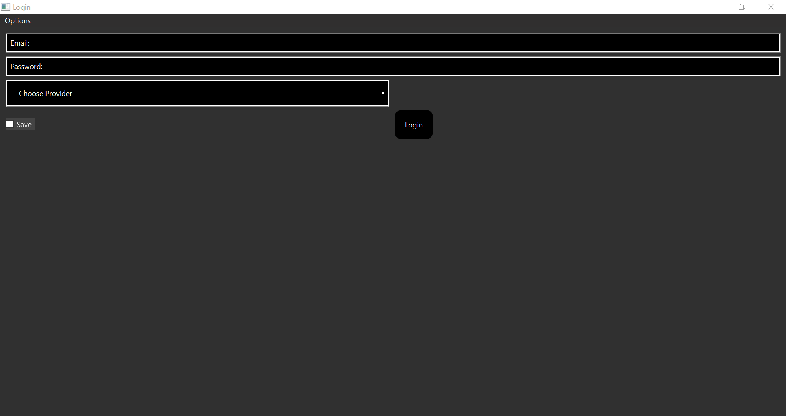
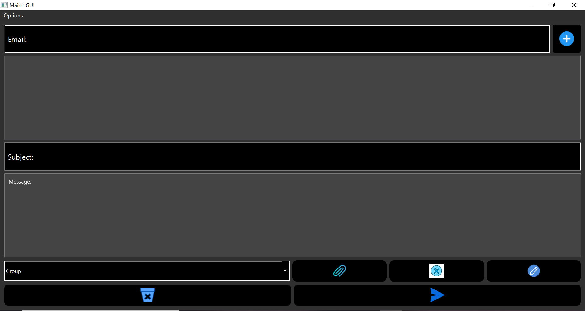

# Getting started

1. Clone the repository.
2. Run `pip install -r requirements.txt` on the root folder of the repo.
3. Then you can execute the gui.py file. Good job, you did it!

# How to use?

After you completed installation process and executed gui.py file, you must login to your account. 

At this point, you have to provide an email, password and provider. Then you'll be able to control stuff with the mail you want to send thanks to the dashboard.

**Please do not modify account.ini file manually.**

# Why use that instead of the provider's application?

Honestly, idk :D.

